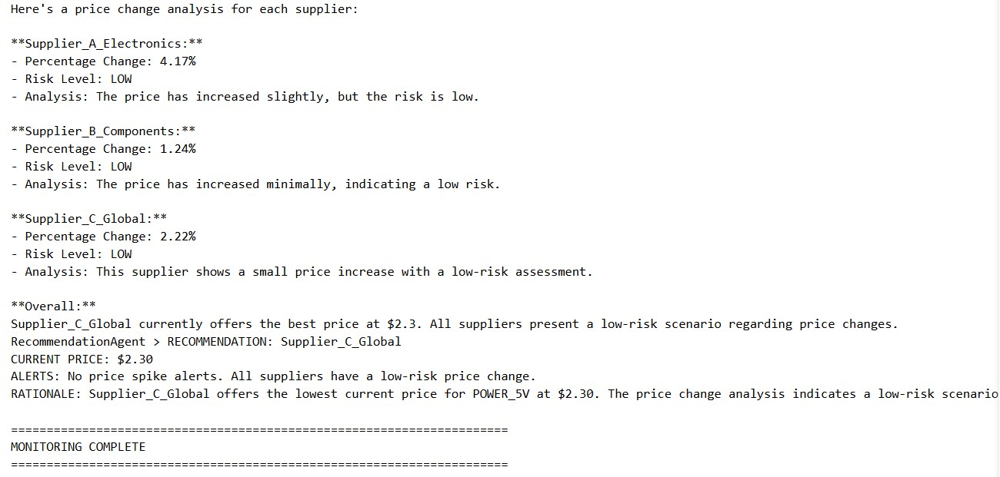

#  SuplaiCerdas - Smart Material Price Monitor Agent for Enterprise Projects
## **Kaggle-Google AI Agents Capstone Project 2025 - Leonhard Satria Suharjo**
MEDIUM blogpost link: https://medium.com/@leonhard.suharjo/how-i-connected-ai-agents-with-manufacturing-supply-chain-3ae196d61e8f


## My project in 34 words.
An enterprise AI agent system that monitors component prices across suppliers for an IOT manufacturing company. The system helps maintain profit margins on tender commitments by detecting price spikes before they impact production costs.

### Real world correlation and motivation 
As someone who is interested and engaged in device and manufacturing business model, I have noticed that projects undertook by companies often take months of work involving multiple processes such as tender, designing, testing, evaluation, mass production and more. Companies had to often commit to a specific price they submitted by the time of the project tender, which is done months in advance to project execution. Due to this nature, I am motivated to start this prototype project that will help companies to monitor risks in prices of components involved in their project, minimizing loss risk.   

### Background knowledge 
This project is submitted as a part of the Kaggle and Google AI Agents intensive course November 2025. Thus, I wil be applying what I learned from the program into this capstone project including involving key concepts into a chosen project track. 

--- 

## Three Key Concepts Demonstrated

### 1. Multi-Agent System (Sequential Pattern)
**Source:** Day 1b Notebook - "Sequential Workflows"

- **PriceCheckAgent** → Retrieves prices from all suppliers
- **ComparisonAgent** → Calculates price changes and risk levels  
- **RecommendationAgent** → Provides procurement decision

**Why Sequential?** Each step depends on the previous one's output. Price data must be retrieved before comparison, comparison must complete before recommendation.

### 2. Custom Function Tools
**Source:** Day 2a Notebook - "Building Custom Function Tools"

**Tool 1: `check_component_prices()`**
- Connects to supplier database
- Returns structured data with status field
- Follows ADK best practices (Day 2a Section 2.2)

**Tool 2: `calculate_price_change()`**
- Calculates percentage change
- Detects risk levels (HIGH >10%, MEDIUM 5-10%, LOW <5%)
- Clear type hints and docstrings

### 3. Basic Evaluation
**Source:** Day 4b Notebook - "Agent Evaluation"

**Test Suite:**
- Tool functionality tests
- Workflow integration tests
- Risk detection validation
---

## Project main flowchart


---

## Project Structure

```
supply-chain-price-monitor/
├── main.py                    # Main agent code
│   ├── Custom function tools
│   ├── Three sequential agents
│   └── Runner logic
│
├── supplier_database.py       # Simulated supplier data
│   ├── Component catalog
│   ├── Price data (3 suppliers)
│   └── Database query functions
│
├── test_agent.py              # Agent evaluation
│   ├── Tool tests
│   ├── Workflow tests
│   └── Integration tests
│
├── requirements.txt           # Dependencies
└── README.md                  # This file
```

---

## Project EndNotes

### Time Investment
- **Development:** 4-6 hours
- **Testing:** 1 hour
- **Documentation:** 1 hour

### Simplifications
- Uses simulated database (not real API calls)
- Terminal interface (no web UI)
- Static supplier data (not live market data)

### Future Enhancements
- Currency conversion for international suppliers
- Replace simulated database with actual supplier APIs
- Implement Tokopedia/Alibaba/Mouser Electronics connectors
- Add API rate limiting and error handling
- Store price history in SQLite database
- Add TrendAnalysisAgent to detect long-term patterns
- Visualize price trends over 3-6 months

---

## Acknowledgments

- **Google & Kaggle:** 5-Day AI Agents Course
- **Course Instructors:** For comprehensive ADK training

---

## Contact

**Leonhard Satria Suharjo**  
University of Messina - Data Analysis  
[GitHub](https://github.com/leonhardsuharjo) | [LinkedIn](https://linkedin.com/in/leonhard-satria-suharjo)

---
